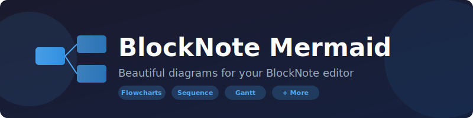
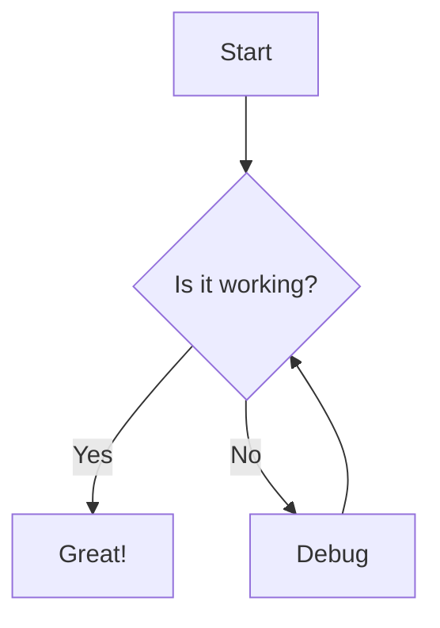
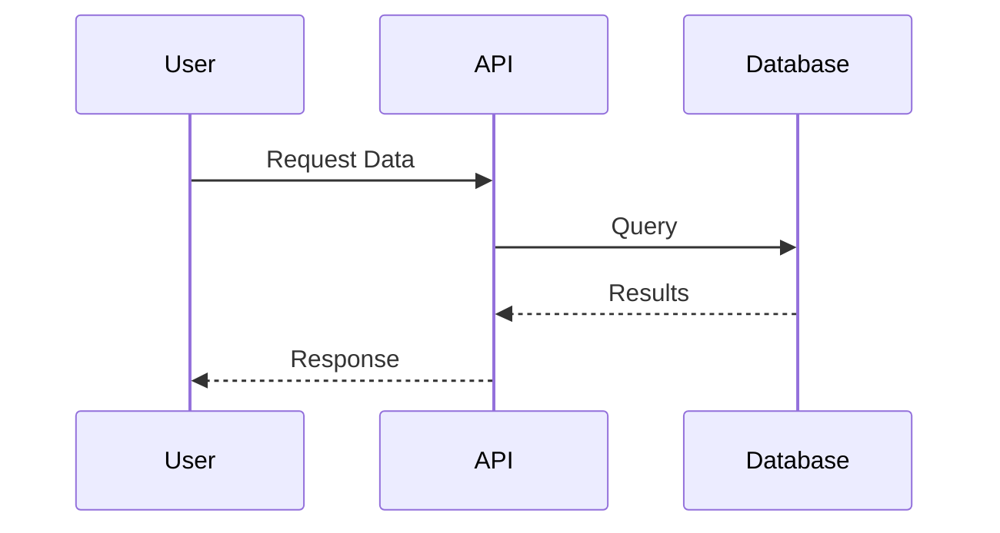

# BlockNote Mermaid



[](https://www.npmjs.com/package/blocknote-mermaid)
[](https://opensource.org/licenses/MIT)


A powerful Mermaid diagram plugin for [BlockNote](https://www.blocknotejs.org/) editor. Create beautiful flowcharts, sequence diagrams, Gantt charts, and more directly in your BlockNote editor.


##  Features

- 📊 **Multiple Diagram Types** - Flowcharts, Sequence diagrams, Gantt charts, Class diagrams, State diagrams, ER diagrams, and more
- 🎨 **Live Preview** - See your diagrams render in real-time as you type
- 📝 **Code Editor** - Syntax-highlighted Mermaid code editor with CodeMirror
- 📋 **Built-in Templates** - Quick-start templates for all diagram types
- 🔍 **Zoom & Pan** - Interactive diagram viewing with zoom controls and panning
- 📥 **Export to SVG** - Download your diagrams as SVG files
- 🔒 **Lock Mode** - Lock diagrams to prevent accidental edits
- 📁 **Collapsible** - Collapse diagrams to save space
- 📱 **Responsive** - Adapts to container width automatically
- 🎯 **Full Screen** - View diagrams in fullscreen mode

## 🚀 Installation

```bash
# Using npm
npm install blocknote-mermaid

# Using yarn
yarn add blocknote-mermaid

# Using pnpm
pnpm add blocknote-mermaid
```

### Peer Dependencies

Make sure you have these peer dependencies installed:

```bash
npm install @blocknote/core @blocknote/react @blocknote/mantine react react-dom react-icons @uiw/react-codemirror
```

## 📖 Usage

### Basic Setup

```tsx
import { BlockNoteSchema, defaultBlockSpecs } from "@blocknote/core";
import { BlockNoteView } from "@blocknote/mantine";
import { useCreateBlockNote, SuggestionMenuController, getDefaultReactSlashMenuItems } from "@blocknote/react";
import { MermaidBlock, insertMermaid } from "blocknote-mermaid";

// Create schema with mermaid block
const schema = BlockNoteSchema.create({
  blockSpecs: {
    ...defaultBlockSpecs,
    mermaid: MermaidBlock,
  },
});

function Editor() {
  const editor = useCreateBlockNote({ schema });

  return (
    <BlockNoteView editor={editor} slashMenu={false}>
      <SuggestionMenuController
        triggerCharacter="/"
        getItems={async (query) =>
          filterSuggestionItems(
            [...getDefaultReactSlashMenuItems(editor), insertMermaid()],
            query
          )
        }
      />
    </BlockNoteView>
  );
}
```

### Using the Mermaid Block

Once integrated, you can:

1. Type `/mermaid` in the editor to insert a new Mermaid block
2. Use the code editor to write your Mermaid diagram code
3. Click on templates to quickly get started with different diagram types
4. Use the toolbar to zoom, pan, download, or toggle fullscreen

### Supported Diagram Types

- **Flowchart** - Process flows, decision trees
- **Sequence Diagram** - API calls, user interactions
- **Class Diagram** - Object-oriented design
- **State Diagram** - State machines
- **Entity Relationship** - Database schemas
- **Gantt Chart** - Project timelines
- **Pie Chart** - Data distribution
- **Mind Map** - Brainstorming
- **Git Graph** - Branch visualizations
- **And more...**

## 🎨 Example Diagrams

### Flowchart



### Sequence Diagram



## 🔧 Configuration

The Mermaid block accepts the following props:

| Prop | Type | Default | Description |
|------|------|---------|-------------|
| `data` | `string` | Default flowchart | The Mermaid diagram code |
| `title` | `string` | "Untitled Diagram" | Title of the diagram |
| `collapsed` | `"true" \| "false"` | `"false"` | Whether the block is collapsed |
| `locked` | `"true" \| "false"` | `"false"` | Whether editing is locked |

## 🤝 Contributing

Contributions are welcome! Please feel free to submit a Pull Request.

1. Fork the repository
2. Create your feature branch (`git checkout -b feature/amazing-feature`)
3. Commit your changes (`git commit -m 'Add some amazing feature'`)
4. Push to the branch (`git push origin feature/amazing-feature`)
5. Open a Pull Request

## 📄 License

This project is licensed under the MIT License - see the [LICENSE](LICENSE) file for details.

## 🙏 Acknowledgments

- [BlockNote](https://www.blocknotejs.org/) - The amazing block-based editor
- [Mermaid](https://mermaid.js.org/) - Diagram and charting tool
- [CodeMirror](https://codemirror.net/) - Code editor component

## 📬 Support

If you have any questions or issues, please open an issue on GitHub.

---

Made with ❤️ by [Yash Gupta](https://github.com/gyash1512)
